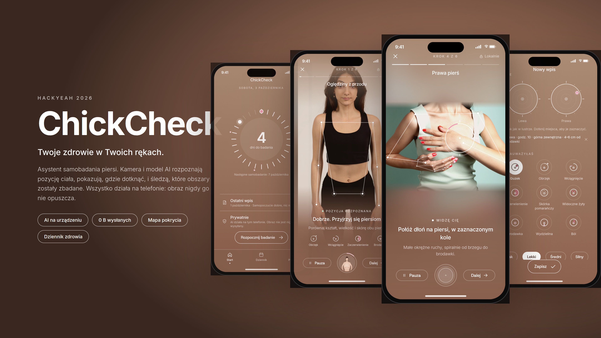

# ChickCheck

Breast self-exam assistant (HackYeah 2026). The phone camera and **on-device** pose estimation and hand-tracking models recognise the
user's pose, show where to touch, track the fingers and map which areas were covered. A local health
log keeps findings with their clinical location. Nothing ever leaves the phone.



## Run

```bash
npm install
npm run web          # http://localhost:8081, rendered in an iPhone 16 mockup
npx tsc --noEmit     # typecheck
```

The camera needs `localhost` or https (browsers block it on plain-http IP addresses).
Useful deep links: `/exam?step=1..6`, `/exam?method=spiral|radial|strips`, `/exam?demo=1` (no camera).

## How the models work

- `src/detection/poseEngine.web.ts` runs **MediaPipe Pose Landmarker** (and Hand Landmarker for the
  fingertips) in the browser. WASM runtime and models are served from `public/`, so there are no
  third-party requests and no frame ever leaves the device. There is no recording or upload code path.
- `src/detection/geometry.ts` turns landmarks into anatomy: breast and armpit targets, pose checks
  (arms down / raised / hands on hips / hand on breast), and the polar coverage grid (3 rings x 8 sectors).
- `src/exam/useAutoFrame.ts` re-frames any camera (e.g. a landscape laptop webcam) so the torso fills the
  portrait screen.
- Without a camera (or on native builds) `MockDetector` animates an illustrated body through the same
  events, so the flow is always demoable.

## Flow

Welcome → About → Preparation → Exam method (spiral / radial / strips) → Guided exam (6 steps) → Summary →
Health log entry (body map with clock-face location, 9 warning signs, pain level). Tabs: Start (cycle dial),
Dziennik (calendar + history), Porady (education).

## Design

Follows the Figma file "HackYeah 2026": brown gradient `#A98972 → #89604D`, white Inter, Host Grotesk
outlined pill buttons, centered title row and bottom-anchored copy. Screens missing from Figma extend the
same rules; accents (blush rings, symptom icons, method diagrams) come from the moodboard on that page.
References: `docs/figma/`.

## Screenshots

`node docs/screenshots/shoot.mjs` (needs the web build running, `chromium` and `ffmpeg`). The exam shots use
stock photos (`docs/demo-feed/`, see CREDITS) as a fake webcam, so detection in them is the real model.

> ChickCheck supports regular self-examination. It does not diagnose and does not replace a doctor.
